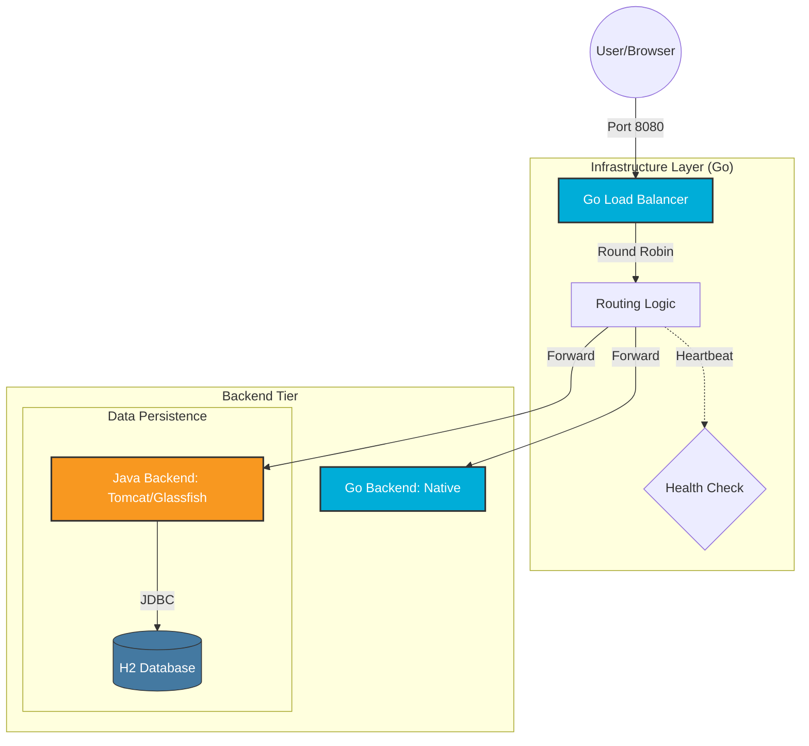

# 🏗️ Jakarta EE Learning + Golang LoadBalancer

A distributed system project demonstrating a high-performance **Golang Load Balancer** sitting in front of a **Java (JSP/Servlet) Backend**.

### 🌌 System Architecture
This project bridges modern systems programming (Go) with enterprise web standards (Java Jakarta EE).

### 📊 Full-Stack Architecture Flow:

* **The Front Door:** Go Load Balancer (Port 8080) - [Go Logic Details](./go-backend/README.md)
* **Backend Instance 1:** Java JSP/Servlet on Tomcat (Port 8081) - [Java Logic Details](./java-backend/README.md)
* **Backend Instance 2:** Go Native Microservice (Port 8082) - Serving as a fallback/secondary node.

### 📂 Explore the Codebase
* [**Java Backend** (Jakarta EE/Tomcat)](./java-backend) — View the core business logic and JSP templates.
* [**Go Infrastructure** (Load Balancer)](./go-backend) — View the networking logic, health checks, and goroutines.

### 🛠️ Key Infra Features
1. **Dynamic Rerouting:** If the Java Tomcat server is killed, the Load Balancer detects the failure within 5 seconds and automatically reroutes all traffic to the Go backend.
2. **Cross-Language Proxying:** Demonstrates the ability to manage traffic between different language runtimes (JVM and Go Binary).
3. **Concurrency Control:** Utilizes Go's concurrency primitives to handle health checks without blocking incoming user requests.

## 🛠️ Prerequisites & Setup

This system is designed to be cross-platform. Ensure you have the following based on your OS:

### 1. Infrastructure Layer (Go)
* **Go 1.26+**: 
  * **macOS**: `brew install go`
  * **Windows**: Download the `.msi` from [golang.org](https://go.dev/dl/)
  * **Linux (Ubuntu/Debian)**: `sudo apt install golang-go`

### 2. Backend Layer (Java)
* **OpenJDK 21+**: 
  * **macOS/Linux**: Use `sdk install java 21-open` (via SDKMAN!)
  * **Windows**: Download from [Adoptium (Eclipse Temurin)](https://adoptium.net/)
* **Apache Tomcat 11**: Required for Jakarta EE 11 support. 
* **Maven**: To build the `.war` file for the Java backend.

### 3. Containerization (Optional but Recommended)
* **Docker Desktop** (Mac/Windows) or **Docker Engine** (Linux) to run the entire stack via one command.

## 🛠️ Developer's Notes & "Real-World" Considerations

While this project is a fully functional distributed system, it was built as a deep-dive into **Infrastructure Logic** and **Cross-Runtime Communication**. Here is how this would differ in a modern production environment:

* **The "JSP" Reality:** I chose **JSP/Servlets** to understand the fundamental request-response lifecycle of the Java ecosystem. In a modern 2026 production environment, I would replace this with a **Spring Boot/Quarkus** REST API and a decoupled frontend (React/Next.js).
* **Database Scaling:** This system uses an **H2 In-Memory Database** for zero-config portability. For a production CRUD application, a persistent RDBMS like **PostgreSQL** or **MySQL** would be used, likely managed via an ORM like Hibernate or Go's GORM.
* **Load Balancing:** The Go Load Balancer here is a "from-scratch" implementation of a **Round Robin** algorithm. In enterprise-grade infra, one might use **Nginx**, **HAProxy**, or **AWS ELB**, but building it in Go proves an understanding of how those tools work under the hood.
* **Security:** This project prioritizes architectural clarity over security hardening. Production apps would require **JWT/OAuth2** for auth and **TLS/SSL** for all container-to-container traffic.

